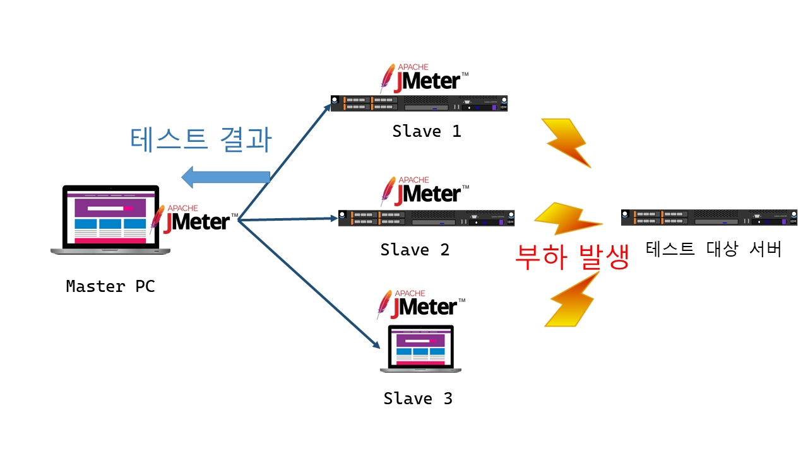
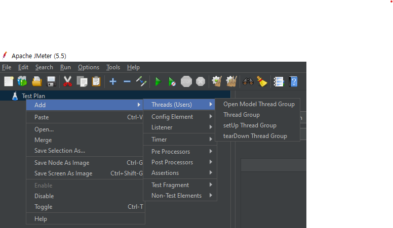
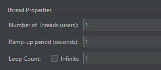
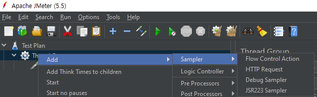
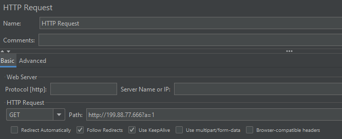
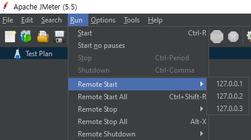

# JMeter Remote를 통한 부하 테스트

공식 문서 : [https://jmeter.apache.org/usermanual/remote-test.html](https://jmeter.apache.org/usermanual/remote-test.html)

### 개요

Apache Jmeter를 이용하면 개발 중인 서버나 디바이스 등에 간단하게 부하 테스트를 진행 할 수 있다. 하지만 부하 테스트를 수행하는 PC에도 높은 부하가 걸리기 때문에 원활한 테스트가 이루어지지 않을 수 있다.

이런 경우 마스터 PC는 부하 테스트 명령, 실행 결과 분석에만 이용하고 여러대의 PC나 서버를 슬레이브로 묶어 마스터 대신 작업을 수행할 수 있다.



### 목차

1. Java 버전 확인
2. Jmeter 및 plugin 설치
3. Jmeter 설정 및 실행
4. 테스트 계획 설정 및 테스트
5. 문제해결

### 1. Java 버전 확인

Jmeter 설치 시 마스터와 모든 슬레이브들의 Java버전, Jmeter 버전을 동일하게 사용해야 에러를 피할 수 있다.

자바 버전을 확인하여 같은 버전으로 맞춰주고, Jmeter는 같은 압축 파일을 이용해 설치하면 실수를 피할 수 있을 것이다.

```bash
//java 버전 확인
java --version
```

### 2. JMeter 및 plugin 설치

Jmeter는 공식 페이지에서 받거나 wget 명령어로 가져올 수 있다. 앞서 설명한 대로 같은 버전으로 맞춰 주는것이 중요하다.

```bash
//설치 페이지
https://jmeter.apache.org/download_jmeter.cgi

//linux 다운로드, 압축해제
wget https://downloads.apache.org//jmeter/binaries/apache-jmeter-5.5.zip

unzip apache-jmeter-5.5.zip
```

Jmeter는 다양한 plugin을 지원하여 자신에게 필요한 기능을 골라 설치하여 이용할 수 있다. plugin 또한 마스터와 슬레이브 양쪽에 동일하게 설치해줘야 에러를 피할 수 있다.

plugin 마다 설치법이 약간씩 다르므로 주의하여 설치하자. Jmeter 하위 폴더의 lib 또는 lib/ext에 설치한다.

```bash
//plugin 설치 페이지
[https://jmeter-plugins.org/](https://jmeter-plugins.org/)

//추천 plugin
1. jpgc-graphs-basic-2.0 : 데이터를 그래프로 표시

2. JMeter Plugins Manage : plugin 관리 매니저
```

### 3. Jmeter 설정 및 실행

마스터의 설정 파일을 수정하여 슬레이브들의 주소를 등록한다. 포트 번호는 따로 설정하지 않으면 디폴트 값 1099로 설정된다.

```bash
// ../bin/jmeter.properties
...
# Remote Hosts - comma delimited
remote_hosts=127.0.0.1,xxx.xx.xxx.xx,..
```

이후 jmeter를 실행한다. 마스터와 슬레이브의 실행파일이 다르므로 주의하여 진행한다.

```bash
//마스터
jmeter.bat (윈도우) / jmeter.sh (리눅스)

//슬레이브
jmeter-server.bat / jmeter-server.sh(리눅스)
```

### 4. 테스트 계획 설정 및 테스트

jmeter 실행 후 다음과 같은 화면을 볼 수 있으며, 테스트 계획을 설정한 후 테스트 할 수 있다.

스레드 그룹을 만든 후 간단한 http request 요청을 걸어보자.




Number of Threads : 사용자 수

Ramp-up Period : 사용자가 모두 생성되는데 걸리는 시간(길수록 천천히 생성)

Loop Count : 반복 횟수

Infinite : 무한반복

이후 간단한 http 요청 설정을 한다. 



테스트 계획 설정이 끝났으면 다음과 같이 슬레이브에 테스트를 명령한다.


### 5. 문제 해결

1. 기본적으로 JMeter의 포트는 1099번을 사용한다. 이 포트로 양방향 통신을 수행할 수 있어야 하기 때문에 방화벽을 해제하거나 SSH 터널링을 사용하여 우회하도록 설정하자.
2. SSL 오류가 발생하는 경우 SSL을 아예 사용하지 않도록 jmeter.properties에 다음과 같이 설정하거나 SSL 설정 후 진행한다.

```
server.rmi.ssl.disable=true
```